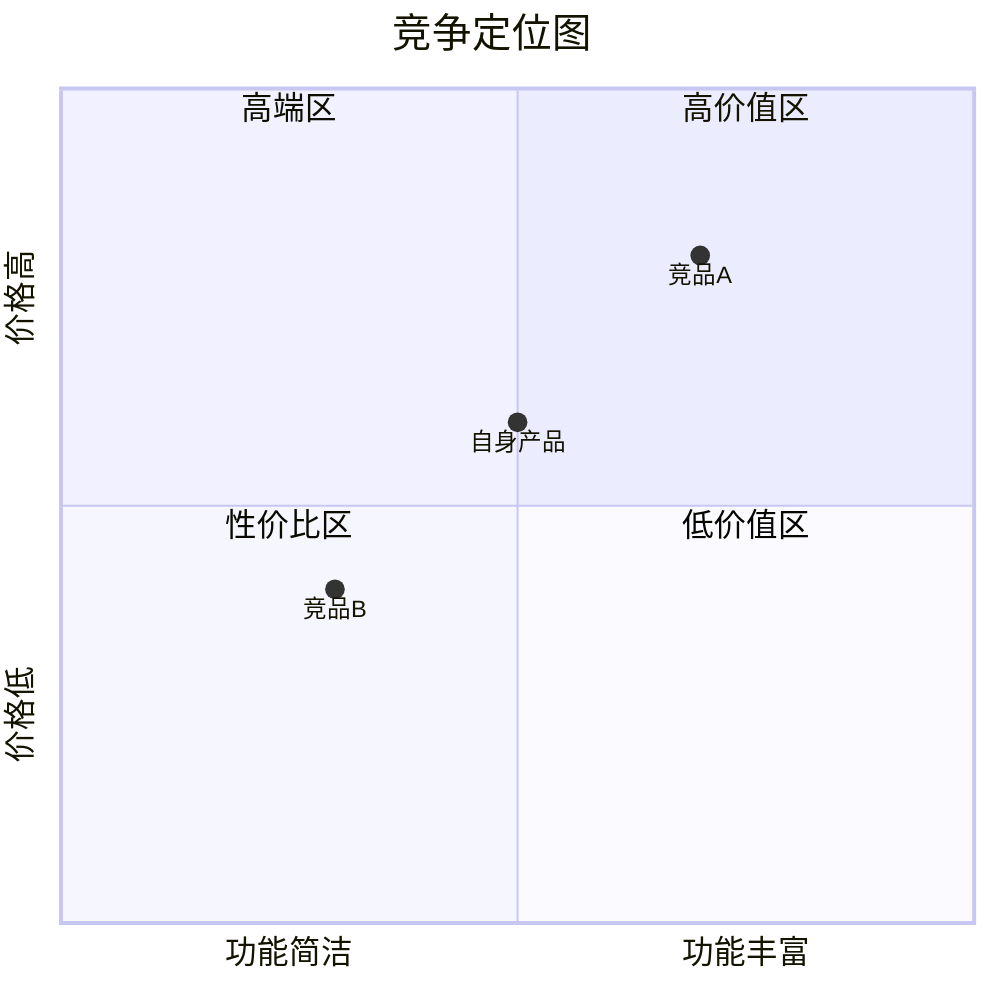

# 综合竞品分析

## 核心原则

1. **多源交叉验证**——单一数据源的竞品情报不可信，每个关键发现必须至少2个独立来源交叉验证，招聘+融资+功能更新三源信号汇聚时战略推断置信度最高
2. **变更即信号**——竞品的每个功能变更、定价调整、招聘变化都是战略信号，不是孤立事件，必须关联解读而非简单罗列
3. **告警分级响应**——P0级（影响≥5）紧急通知+标记需紧急响应，P1级（影响=4）即时通知+纳入周报，P2级（影响<4）仅纳入周报，资源分配与影响程度匹配
4. **战略推断标注置信度**——招聘推断战略方向置信度0.5-0.7，融资+招聘双重信号0.7-0.9，官方公告0.9+，低置信度推断必须升级人类验证
5. **四象限定义先行**——直接/间接/替代/潜在四个象限有严格定义（相同品类+相同用户+相同功能 / 相同场景+不同方案 / 非产品化方式 / 有能力进入），分类必须基于定义而非直觉
6. **象限间流动可追踪**——竞品不是静态归属某一象限，间接竞品可能升级为直接竞品，潜在竞品可能变为直接竞品，标注流动信号和预估时间线
7. **潜在竞品默认需验证**——潜在竞品象限的每一项默认needs_human_validation=true，因为潜在竞品的识别基于推断信号（招聘/专利/融资），不确定性最高
8. **空象限即风险提示**——任一象限为空不是"没有竞品"，而是"未识别到竞品"，必须标注该象限需补充，建议人类提供线索
9. **数据驱动结论先行**——每个结论必须有数据或证据支撑，禁止无依据推断
10. **结构化输出可交付**——报告是给决策者看的，不是给AI看的，可读性优先
11. **洞察重于数据堆砌**——数据是手段，洞察是目的，每份数据必须回答"所以呢"
12. **行动建议可执行**——策略建议必须具体到"做什么+为什么+预期效果"

## 交互模式

🤖→👤 AI建议人类审批

## 输入

| 输入项 | 类型 | 必填 | 来源 | 说明 |
|--------|------|------|------|------|
| competitor_list | array | 是 | 用户提供 | 竞品列表，每项含名称、品类、官网URL |
| category_keywords | string | 是 | 用户提供 | 品类关键词，如"在线教育""SaaS CRM" |
| monitor_config | object | 否 | 用户提供 | 监控配置，含扫描频率、关注维度、告警阈值 |
| 市场规模数据 | JSON | ○ | output/pm-discovery/market-tam-som/tam-som.json | TAM/SAM/SOM与增长率 |
| 宏观环境数据 | JSON | ○ | output/pm-discovery/market-pest/pest.json | PEST四维度趋势 |
| 自身产品信息 | string/markdown | ○ | 用户提供 | 自身产品定位、核心功能、目标用户、当前状态 |

## 执行步骤

### Step 1: 竞品情报采集

多源信息采集，覆盖竞品全方位动态：

| 采集源 | 采集内容 | 采集频率 |
|--------|---------|---------|
| App版本更新监控 | 版本号、更新日志、功能变更、发布时间 | 每次版本发布 |
| 官网/博客更新 | 产品页变更、新功能公告、战略文章、定价页变更 | 每日 |
| App评论采集 | 用户评分、评论内容、情感倾向、高频关键词 | 每周 |
| 定价页面监控 | 价格变动、套餐调整、优惠活动、新定价模式 | 每日 |
| 招聘信息监控 | 新增岗位、岗位数量变化、技术栈要求、地域分布 | 每周 |
| 行业新闻/融资信息 | 融资轮次金额、战略合作、并购、行业排名 | 实时 |

**招聘信息战略推断规则：**
- 大量招聘某技术栈岗位 → 推断技术方向投入
- 新增海外岗位 → 推断国际化战略
- 招聘量骤减 → 推断成本收缩或战略调整
- 新增AI/ML岗位 → 推断智能化方向

#### Feature Matrix自动更新

| 步骤 | 说明 |
|------|------|
| 检测版本更新 | 从采集层获取版本更新信息 |
| 提取功能变更 | 解析更新日志，提取新增/升级/移除功能 |
| 与现有矩阵对比 | 对比Feature Matrix，标注变更类型 |
| 评估影响程度 | 1-5分评估对竞争格局的影响 |
| 触发告警 | 影响程度≥4实时告警 |

**变更类型定义：**
- 新增（Added）：竞品新增此前不具备的功能
- 升级（Upgraded）：竞品对现有功能进行重大改进
- 移除（Removed）：竞品下线某项功能
- 降级（Downgraded）：竞品对现有功能进行限制或降级

#### 竞品用户口碑对比

| 分析维度 | 说明 |
|---------|------|
| 情感分布对比 | 各竞品正面/中性/负面情感占比对比 |
| 高频痛点对比 | 提取各竞品Top痛点，横向对比 |
| 差异化机会 | 识别竞品共性痛点，标记为差异化机会 |
| 竞争劣势预警 | 识别自身相对竞品的口碑劣势项 |
| 用户迁移信号 | 检测竞品用户表达不满或迁移意向的评论 |

#### 定价策略对比

| 分析维度 | 说明 |
|---------|------|
| 价格区间对比 | 各竞品定价区间与均价对比 |
| 套餐结构对比 | 免费/基础/专业/企业版功能分布对比 |
| 定价模式变化 | 检测定价模式变更（如按量→订阅） |
| 性价比评估 | 功能覆盖度/价格比对比 |

#### 功能更新解读

- 功能变更的战略意图解读
- 对用户价值的影响评估
- 对竞争格局的影响评估
- 建议的应对措施

#### 战略方向推断

综合招聘、融资、功能更新、定价变化等多源信号，推断竞品战略方向：
- 市场扩张 / 收缩方向
- 技术投入方向
- 目标客群迁移方向
- 商业模式演进方向

### Step 2: 四象限定位

#### 直接竞品识别

**定义：** 相同品类 + 相同目标用户 + 相同核心功能

**识别逻辑：**
1. 从已知竞品列表中筛选品类完全匹配的竞品
2. 基于品类关键词搜索应用商店同分类产品
3. 通过产品目录/行业数据库检索同类产品
4. SEO竞品分析（搜索相同核心关键词的竞品投放）

**数据源：**

| 数据源 | 采集内容 | 可靠性 |
|--------|---------|--------|
| 应用商店分类 | 同分类下的产品列表 | 高 |
| 产品目录（如G2/Capterra） | 同品类产品对比列表 | 高 |
| SEO竞品分析 | 搜索相同关键词的竞品 | 中 |
| 行业协会/数据库 | 行业成员/认证产品 | 高 |

#### 间接竞品识别

**定义：** 相同用户场景 + 不同解决方案

**识别逻辑：**
1. 分析目标用户场景，列出所有可能的解决方式
2. 从用户反馈中提取提及的替代产品
3. 搜索词分析：用户搜索品类关键词时同时搜索的其他产品
4. 识别解决相同场景但技术路径/商业模式不同的产品

**数据源：**

| 数据源 | 采集内容 | 可靠性 |
|--------|---------|--------|
| 用户反馈替代方案 | 用户评论中提及的替代产品 | 中 |
| 搜索词关联分析 | 品类关键词的关联搜索词 | 中 |
| 场景映射分析 | 同场景不同解决方案的产品 | 中 |
| 社区/论坛讨论 | 用户讨论中的替代推荐 | 中 |

#### 替代方案识别

**定义：** 用户当前非产品化解决方式

**识别逻辑：**
1. 识别目标用户在没有该品类产品时的解决方式
2. 从用户访谈数据中提取当前工作流/手动流程
3. 从问卷调查中收集非产品化替代方式
4. 从论坛/社区讨论中提取DIY方案/手动流程

**数据源：**

| 数据源 | 采集内容 | 可靠性 |
|--------|---------|--------|
| 用户访谈数据 | 用户描述的当前解决方式 | 高 |
| 问卷调查 | 用户选择的替代方式 | 高 |
| 论坛/社区 | DIY方案、手动流程讨论 | 中 |
| 行业报告 | 行业中非产品化解决比例 | 中 |

#### 潜在竞品识别

**定义：** 有能力进入该领域的公司

**识别逻辑：**
1. 招聘信息监控：检测相关技术/市场岗位的招聘
2. 专利分析：检索相关技术领域的专利申请
3. 融资信息：关注获得相关领域融资的公司
4. 战略公告：分析公司战略中提及的相关方向

**数据源：**

| 数据源 | 采集内容 | 可靠性 |
|--------|---------|--------|
| 招聘信息 | 相关技术/市场岗位招聘 | 低-中 |
| 专利数据库 | 相关技术专利申请 | 中 |
| 融资信息 | 相关领域融资事件 | 中 |
| 战略公告 | 公司战略中提及的相关方向 | 低-中 |
| 产业链分析 | 上下游企业延伸能力 | 低 |

#### 置信度评估与人类验证标注

对每个象限的每项竞品进行置信度评估：

| 评估维度 | 说明 |
|---------|------|
| 数据来源可靠性 | 数据源的可信程度（0-1） |
| 证据充分性 | 支持该分类的证据数量与质量 |
| 分类确定性 | 该竞品归入该象限的确定程度 |

**置信度分级：**
- 高（0.8-1.0）：多源交叉验证，分类确定
- 中（0.5-0.8）：有数据支撑但来源单一或部分矛盾
- 低（<0.5）：推断性结论，需人类验证

#### 象限间流动标注

对识别出的竞品进行象限间流动可能性评估：

| 流动类型 | 触发信号 | 预估时间线 |
|---------|---------|-----------|
| 间接→直接 | 间接竞品推出相同品类产品线、功能趋同化 | 6-18个月 |
| 潜在→直接 | 潜在竞品正式发布同类产品、完成市场验证 | 12-24个月 |
| 潜在→间接 | 潜在竞品推出差异化方案切入相同场景 | 6-12个月 |
| 替代→间接 | 非产品化方式被产品化（如工具化、平台化） | 12-36个月 |

**流动标注规则：**
- 每项竞品可选填 `flow_signal`（流动信号描述）和 `estimated_flow_timeline`（预估流动时间线）
- 仅有明确信号时才标注流动，无信号则不填
- 流动信号需附带数据来源

### Step 3: 竞品分析报告

#### 数据整合与竞品画像构建

整合Step 1和Step 2数据，为每个核心竞品构建完整画像：

| 画像维度 | 数据来源 | 说明 |
|----------|---------|------|
| 产品定位 | Step 1 / 用户提供 | 一句话定位、目标用户、核心价值主张 |
| 功能矩阵 | Step 1 → feature_matrix | 功能覆盖度对比，标注差异化功能 |
| 用户口碑 | Step 1 → reputation | 情感分布、Top痛点、用户迁移信号 |
| 定价策略 | Step 1 → pricing | 价格区间、套餐结构、性价比评估 |
| 商业模式 | 用户提供 / AI推断 | 收入模式、获客方式、增长策略 |
| 团队与融资 | 用户提供 / AI推断 | 团队规模、融资轮次、资金储备 |
| 战略方向 | Step 1 → strategic_signals | 推断的战略重心与置信度 |

**竞品筛选规则**：
- 深度画像数量：3-5个核心竞品（直接竞品优先）
- 超过5个时，按威胁程度排序取Top5
- 间接/替代竞品各取1-2个代表性案例

#### SWOT分析（逐竞品）

为每个核心竞品生成SWOT分析：

**Strengths（优势）**：
- 从feature_matrix中提取该竞品独有或领先的功能
- 从reputation中提取正面评价集中的维度
- 从pricing中提取定价优势

**Weaknesses（劣势）**：
- 从reputation.top_pain_points提取高频痛点
- 从feature_matrix中提取缺失功能
- 从pricing中提取性价比劣势

**Opportunities（机会）**：
- 竞品口碑中的共性痛点 → 自身的差异化机会
- 竞品战略方向的空白领域
- 市场增长中的未覆盖细分

**Threats（威胁）**：
- 竞品即将推出的功能（从strategic_signals推断）
- 竞品定价下调或免费化趋势
- 潜在竞品进入信号

**SWOT交叉策略矩阵**：

| 交叉 | 策略类型 | 说明 |
|------|---------|------|
| S+O | 增长策略 | 用优势抓住机会 |
| W+O | 改进策略 | 补短板以抓住机会 |
| S+T | 防御策略 | 用优势抵御威胁 |
| W+T | 危机预案 | 劣势遭遇威胁时的应对 |

#### 竞争定位图（Perceptual Map）

基于两个核心维度绘制竞争定位图：

**维度选择规则**：
- 优先选择用户决策时最关注的2个维度
- 常见维度组合：

| 品类特征 | 推荐维度X | 推荐维度Y |
|----------|----------|----------|
| 通用 | 功能丰富度 | 易用性 |
| 企业级 | 功能完整度 | 价格 |
| 消费级 | 用户体验 | 性价比 |
| 技术型 | 技术先进性 | 生态成熟度 |
| 垂直型 | 垂直深度 | 横向覆盖 |

**定位图输出**（Mermaid象限图）：


#### 竞争护城河评估

评估各竞品的护城河深度：

| 护城河类型 | 评估维度 | 评分标准 |
|-----------|---------|---------|
| 网络效应 | 用户增长是否增强产品价值 | 0-5分 |
| 转换成本 | 用户迁移到竞品的成本 | 0-5分 |
| 规模经济 | 规模是否带来成本优势 | 0-5分 |
| 品牌壁垒 | 品牌认知度和信任度 | 0-5分 |
| 技术壁垒 | 核心技术的不可复制性 | 0-5分 |
| 数据壁垒 | 数据积累的不可替代性 | 0-5分 |
| 生态壁垒 | 合作伙伴和集成生态 | 0-5分 |

**护城河深度评级**：
- 总分≥25：深护城河（难以撼动）
- 总分15-24：中等护城河（有突破空间）
- 总分<15：浅护城河（容易切入）

#### 市场份额估算

基于可用数据估算竞争格局：

| 估算方法 | 适用条件 | 数据来源 |
|----------|---------|---------|
| 自上而下 | 有TAM数据和公开市场份额 | 行业报告 + TAM数据 |
| 自下而上 | 有各竞品用户量/收入数据 | 竞品公开数据 |
| 相对份额 | 仅有定性对比 | AI基于多源信号推断 |

**市场集中度评估**：
- HHI指数计算（赫芬达尔-赫希曼指数）
- HHI<1500：分散竞争 / 1500-2500：适度集中 / >2500：高度集中

#### 差异化策略建议

基于前序分析，生成差异化策略建议：

**策略推导逻辑**：

| 分析输入 | 策略方向 |
|----------|---------|
| 竞品共性痛点 | 痛点突破策略：解决竞品都未解决的核心问题 |
| 护城河浅的竞品 | 侧翼突破策略：从护城河最薄弱的竞品切入 |
| 定位图空白区域 | 定位空白策略：占据竞品未覆盖的定位空间 |
| SWOT交叉矩阵 | 杠杆策略：用自身优势抓住竞品劣势暴露的机会 |
| 市场分散格局 | 聚焦策略：在分散市场中聚焦一个细分做深 |

**每条策略包含**：
- 策略名称与一句话描述
- 策略依据（引用具体分析数据）
- 预期效果
- 风险与前提条件
- 优先级（P0/P1/P2）

#### 报告组装

将所有分析整合为完整的Markdown报告：

**报告结构**：

```
# {品类}竞品分析报告

## 执行摘要
- 一段话总结竞争格局
- 3条核心发现
- Top1策略建议

## 1. 市场概览
- 市场规模（TAM/SAM/SOM）
- 增长趋势与驱动力
- 宏观环境影响（PEST关键因素）

## 2. 竞争格局
- 四象限分类总览
- 市场份额估算
- 市场集中度评估

## 3. 竞品深度分析
### 3.1 {竞品A名称}
- 产品画像
- SWOT分析
- 护城河评估
### 3.2 {竞品B名称}
- ...

## 4. Feature Matrix功能对比
- 核心功能对比表
- 差异化功能标注
- 功能覆盖度评分

## 5. 用户口碑对比
- 情感分布对比
- Top痛点横向对比
- 差异化机会识别

## 6. 定价策略对比
- 价格区间对比
- 套餐结构对比
- 性价比评估

## 7. 竞争定位图
- Perceptual Map
- 定位空白区域分析

## 8. 差异化策略建议
- 策略1：{名称}
- 策略2：{名称}
- 策略3：{名称}

## 附录
- 数据来源清单
- 置信度标注
- 分析方法说明
```

## 输出

**存储路径**：`output/pm-discovery/market-competitor-analysis/`

**输出文件**：

| 文件 | 格式 | 说明 |
|------|------|------|
| competitor-analysis.json | JSON | 结构化数据（包含intel数据 + quadrant数据 + report摘要） |
| competitor-analysis.md | Markdown | 完整竞品分析报告 |

**competitor-analysis.json 输出Schema**：

```json
{
  "type": "object",
  "required": ["scan_timestamp", "competitors", "quadrants", "executive_summary", "competitor_profiles", "differentiation_strategies"],
  "properties": {
    "scan_timestamp": {"type": "string", "description": "扫描时间戳"},
    "competitors": {"type": "array", "description": "竞品情报列表，含Feature Matrix、口碑、定价和战略信号"},
    "reputation_comparison": {"type": "object", "description": "竞品口碑横向对比"},
    "alerts": {"type": "array", "description": "竞品变更告警列表"},
    "category_keywords": {"type": "string", "description": "品类关键词"},
    "quadrants": {"type": "object", "description": "四象限竞品分类，含直接/间接/替代/潜在竞品"},
    "quadrant_summary": {"type": "object", "description": "四象限分类统计摘要"},
    "report_metadata": {"type": "object", "description": "报告元数据，含品类、时间戳和置信度"},
    "executive_summary": {"type": "object", "description": "执行摘要，含竞争格局总结和核心发现"},
    "market_overview": {"type": "object", "description": "市场概览，含TAM/SAM/SOM和增长趋势"},
    "competitive_landscape": {"type": "object", "description": "竞争格局，含四象限摘要和市场份额估算"},
    "competitor_profiles": {"type": "array", "description": "竞品深度画像列表，含SWOT和护城河评估"},
    "feature_matrix_summary": {"type": "object", "description": "功能矩阵对比摘要"},
    "perceptual_map": {"type": "object", "description": "竞争定位图数据"},
    "differentiation_strategies": {"type": "array", "description": "差异化策略建议列表"}
  }
}
```

### 输出校验规则

| 字段路径 | 类型 | 必填 | 说明 |
|---------|------|------|------|
| scan_timestamp | string | 是 | ISO 8601格式时间戳，不得为空或未来时间 |
| competitors | array | 是 | 至少包含1个竞品条目，每条须含name和category |
| competitors[].feature_matrix | object | 是 | 须包含features数组和last_updated时间戳 |
| competitors[].feature_matrix.features | array | 是 | 每项须含feature_name、status、impact_degree、source |
| competitors[].feature_matrix.features[].impact_degree | integer | 是 | 取值1-5，须为整数 |
| competitors[].feature_matrix.features[].source | string | 是 | 数据来源不得为空，关键发现须标注≥2个独立来源 |
| competitors[].reputation | object | 是 | 须包含sentiment_distribution、top_pain_points、data_sources |
| competitors[].reputation.sentiment_distribution | object | 是 | positive+neutral+negative之和须为1.0（误差±0.01） |
| competitors[].reputation.data_sources | array | 是 | 至少标注1个口碑数据来源 |
| competitors[].pricing | object | 是 | 须包含price_range、plan_structure、value_score |
| competitors[].pricing.value_score | number | 是 | 取值0.0-1.0，保留两位小数 |
| competitors[].strategic_signals | object | 是 | 须包含direction、confidence、evidence、needs_human_validation |
| competitors[].strategic_signals.confidence | number | 是 | 取值0.0-1.0，<0.5时needs_human_validation必须为true |
| competitors[].strategic_signals.evidence | array | 是 | 至少包含1条证据，每条须标注来源类型和置信度 |
| competitors[].strategic_signals.needs_human_validation | boolean | 是 | 置信度<0.5或仅单一来源推断时必须为true |
| reputation_comparison | object | 否 | 若competitors数量≥2则必填，须含common_pain_points、differentiation_opportunities |
| reputation_comparison.common_pain_points | array | 否 | 每项须含痛点描述和涉及的竞品列表 |
| reputation_comparison.differentiation_opportunities | array | 否 | 每项须含机会描述和关联的竞品共性痛点 |
| reputation_comparison.competitive_disadvantages | array | 否 | 每项须含劣势描述和对比竞品名称 |
| alerts | array | 否 | 影响程度≥4的变更必须生成告警条目 |
| alerts[].impact_degree | integer | 是 | 取值1-5，≥4时须触发通知机制 |
| alerts[].recommendation | string | 是 | 应对建议不得为空，须为可执行的具体建议 |
| alerts[].timestamp | string | 是 | ISO 8601格式时间戳，不得为空 |
| category_keywords | string | 是 | 品类关键词，不可为空字符串 |
| quadrants | object | 是 | 四象限容器，必须包含全部四个子象限 |
| quadrants.direct_competitors | object | 是 | 直接竞品象限，definition不可为空 |
| quadrants.direct_competitors.items | array | 是 | 直接竞品列表，可为空数组但需标注需补充 |
| quadrants.direct_competitors.items[].name | string | 是 | 竞品名称，不可为空 |
| quadrants.direct_competitors.items[].confidence | number | 是 | 置信度，范围0-1 |
| quadrants.direct_competitors.items[].data_source | string | 是 | 数据来源，不可为空 |
| quadrants.direct_competitors.items[].needs_human_validation | boolean | 是 | 是否需人类验证，置信度<0.5时必须为true |
| quadrants.indirect_competitors | object | 是 | 间接竞品象限，definition不可为空 |
| quadrants.indirect_competitors.items | array | 是 | 间接竞品列表，可为空数组但需标注需补充 |
| quadrants.indirect_competitors.items[].name | string | 是 | 竞品名称，不可为空 |
| quadrants.indirect_competitors.items[].confidence | number | 是 | 置信度，范围0-1 |
| quadrants.indirect_competitors.items[].data_source | string | 是 | 数据来源，不可为空 |
| quadrants.indirect_competitors.items[].needs_human_validation | boolean | 是 | 是否需人类验证，置信度<0.5时必须为true |
| quadrants.substitutes | object | 是 | 替代方案象限，definition不可为空 |
| quadrants.substitutes.items | array | 是 | 替代方案列表，可为空数组但需标注需补充 |
| quadrants.substitutes.items[].name | string | 是 | 替代方案名称，不可为空 |
| quadrants.substitutes.items[].confidence | number | 是 | 置信度，范围0-1 |
| quadrants.substitutes.items[].data_source | string | 是 | 数据来源，不可为空 |
| quadrants.substitutes.items[].needs_human_validation | boolean | 是 | 是否需人类验证，置信度<0.5时必须为true |
| quadrants.potential_competitors | object | 是 | 潜在竞品象限，definition不可为空 |
| quadrants.potential_competitors.items | array | 是 | 潜在竞品列表，可为空数组但需标注需补充 |
| quadrants.potential_competitors.items[].name | string | 是 | 竞品名称，不可为空 |
| quadrants.potential_competitors.items[].confidence | number | 是 | 置信度，范围0-1 |
| quadrants.potential_competitors.items[].data_source | string | 是 | 数据来源，不可为空 |
| quadrants.potential_competitors.items[].needs_human_validation | boolean | 是 | 是否需人类验证，**默认必须为true** |
| quadrant_summary | object | 是 | 分类统计摘要 |
| quadrant_summary.total_items | number | 是 | 竞品总数，应等于四象限items数量之和 |
| quadrant_summary.by_confidence | object | 是 | 按置信度分级的统计 |
| quadrant_summary.by_confidence.high | number | 是 | 高置信度项数（≥0.8） |
| quadrant_summary.by_confidence.medium | number | 是 | 中置信度项数（0.5-0.8） |
| quadrant_summary.by_confidence.low | number | 是 | 低置信度项数（<0.5） |
| quadrant_summary.needs_validation_count | number | 是 | 需人类验证的项数 |
| report_metadata | object | 是 | 报告元数据，必须包含category、generated_at、competitors_analyzed、data_sources、overall_confidence |
| report_metadata.category | string | 是 | 品类关键词，不可为空 |
| report_metadata.generated_at | string | 是 | ISO 8601时间戳 |
| report_metadata.competitors_analyzed | integer | 是 | 分析的竞品数量，≥3 |
| report_metadata.data_sources | array | 是 | 数据来源清单，不可为空数组 |
| report_metadata.overall_confidence | number | 是 | 整体置信度，范围0.0-1.0 |
| executive_summary | object | 是 | 执行摘要 |
| executive_summary.competition_landscape | string | 是 | 竞争格局一段话总结，≥50字 |
| executive_summary.key_findings | array | 是 | 核心发现列表，长度=3 |
| executive_summary.top_strategy | string | 是 | Top1策略建议，不可为空 |
| market_overview | object | 否 | 市场概览，缺失时标注"缺乏市场规模数据" |
| market_overview.tam | number | 条件必填 | market_overview存在时必填，>0 |
| market_overview.sam | number | 条件必填 | market_overview存在时必填，>0且≤tam |
| market_overview.som | number | 条件必填 | market_overview存在时必填，>0且≤sam |
| market_overview.growth_rate | string | 条件必填 | market_overview存在时必填，格式如"12.5%" |
| market_overview.key_drivers | array | 条件必填 | market_overview存在时必填，≥1项 |
| market_overview.pest_highlights | array | 否 | PEST关键因素，缺失时可为空数组 |
| competitive_landscape | object | 否 | 竞争格局 |
| competitive_landscape.quadrant_summary | object | 条件必填 | competitive_landscape存在时必填 |
| competitive_landscape.market_share_estimate | array | 条件必填 | competitive_landscape存在时必填，≥1项 |
| competitive_landscape.hhi_index | number | 条件必填 | competitive_landscape存在时必填，范围0-10000 |
| competitive_landscape.concentration_level | string | 条件必填 | competitive_landscape存在时必填，枚举值：分散/适度集中/高度集中 |
| competitor_profiles | array | 是 | 竞品深度画像列表，长度3-5 |
| competitor_profiles[].name | string | 是 | 竞品名称，不可为空 |
| competitor_profiles[].positioning | string | 是 | 一句话定位，不可为空 |
| competitor_profiles[].swot | object | 是 | SWOT分析，必须包含strengths/weaknesses/opportunities/threats四个数组，每个数组≥1项 |
| competitor_profiles[].swot.strengths | array | 是 | 优势列表，≥1项 |
| competitor_profiles[].swot.weaknesses | array | 是 | 劣势列表，≥1项 |
| competitor_profiles[].swot.opportunities | array | 是 | 机会列表，≥1项 |
| competitor_profiles[].swot.threats | array | 是 | 威胁列表，≥1项 |
| competitor_profiles[].moat_score | object | 是 | 护城河评估 |
| competitor_profiles[].moat_score.network_effects | number | 是 | 网络效应评分，0-5 |
| competitor_profiles[].moat_score.switching_cost | number | 是 | 转换成本评分，0-5 |
| competitor_profiles[].moat_score.scale_economy | number | 是 | 规模经济评分，0-5 |
| competitor_profiles[].moat_score.brand | number | 是 | 品牌壁垒评分，0-5 |
| competitor_profiles[].moat_score.technology | number | 是 | 技术壁垒评分，0-5 |
| competitor_profiles[].moat_score.data | number | 是 | 数据壁垒评分，0-5 |
| competitor_profiles[].moat_score.ecosystem | number | 是 | 生态壁垒评分，0-5 |
| competitor_profiles[].moat_score.total | number | 是 | 护城河总分，=7项评分之和，0-35 |
| competitor_profiles[].moat_score.level | string | 是 | 护城河深度，枚举值：深/中/浅 |
| feature_matrix_summary | object | 否 | 功能矩阵对比摘要 |
| feature_matrix_summary.total_features_compared | integer | 条件必填 | feature_matrix_summary存在时必填，>0 |
| feature_matrix_summary.differentiation_features | array | 条件必填 | feature_matrix_summary存在时必填，≥1项 |
| feature_matrix_summary.coverage_scores | object | 条件必填 | feature_matrix_summary存在时必填，各竞品覆盖率评分 |
| perceptual_map | object | 否 | 竞争定位图数据 |
| perceptual_map.x_axis | string | 条件必填 | perceptual_map存在时必填，X轴维度名称 |
| perceptual_map.y_axis | string | 条件必填 | perceptual_map存在时必填，Y轴维度名称 |
| perceptual_map.positions | array | 条件必填 | perceptual_map存在时必填，≥2个竞品坐标点 |
| perceptual_map.positions[].name | string | 是 | 竞品名称 |
| perceptual_map.positions[].x | number | 是 | X轴坐标，0.0-1.0 |
| perceptual_map.positions[].y | number | 是 | Y轴坐标，0.0-1.0 |
| perceptual_map.white_space | string | 条件必填 | perceptual_map存在时必填，空白区域描述 |
| differentiation_strategies | array | 是 | 差异化策略建议列表，≥3条 |
| differentiation_strategies[].name | string | 是 | 策略名称，不可为空 |
| differentiation_strategies[].description | string | 是 | 一句话描述，不可为空 |
| differentiation_strategies[].evidence | string | 是 | 策略依据，必须引用具体分析数据 |
| differentiation_strategies[].expected_impact | string | 是 | 预期效果，不可为空 |
| differentiation_strategies[].risks | string | 是 | 风险与前提，不可为空 |
| differentiation_strategies[].priority | string | 是 | 优先级，枚举值：P0/P1/P2 |

## 决策规则

| 规则 | 触发条件 | 动作 |
|------|---------|------|
| P0级告警（自动通知+紧急标记） | 功能变更影响程度 ≥ 5 | 即时通知人类PM，标记需紧急响应，不等待周报周期 |
| P1级告警（自动通知） | 功能变更影响程度 4 | 即时通知人类PM，纳入下次周报详细分析 |
| 战略推断升级 | 竞品战略推断置信度 < 0.5 | 升级人类判断，标注需验证 |
| 定价变化告警 | 竞品定价发生变更 | 通知人类PM定价变化详情与影响分析 |
| 口碑异常告警 | 竞品口碑出现重大波动（情感分布变化>15%） | 通知人类PM口碑变化分析 |
| 潜在竞品需验证 | 潜在竞品象限的任何项 | 默认标注needs_human_validation=true，置信度通常较低需人类确认 |
| 象限最低填充 | 任一象限为空 | 标注该象限需补充，建议人类提供线索 |
| 低置信度标注 | 置信度 < 0.5 | 标注需人类验证，说明不确定原因 |
| 核心竞品数量<3 | 竞品深度分析阶段 | 标注"竞品覆盖不足"，建议补充竞品后再生成报告 |
| 核心竞品数量>7 | 竞品深度分析阶段 | 按威胁程度排序，取Top5深度分析，其余列入简表 |
| 护城河评估数据不足 | 护城河评估阶段 | 标注各维度置信度，低置信度维度给出推断依据 |
| 市场份额无公开数据 | 市场份额估算阶段 | 使用相对份额估算，明确标注"估算值"和估算方法 |
| 自身产品信息缺失 | 差异化策略建议阶段 | 差异化策略建议标注为"通用建议"，需结合自身情况调整 |
| PEST数据缺失 | 市场概览阶段 | 市场概览中跳过宏观环境章节，标注"缺乏PEST数据" |

## 质量检查

- [ ] Feature Matrix已更新，变更已标注类型和影响程度
- [ ] 竞品口碑对比已完成
- [ ] 差异化机会已识别
- [ ] 定价策略对比已完成
- [ ] 战略方向推断已完成，低置信度已标注
- [ ] 告警已触发（影响程度≥4的变更）
- [ ] 数据来源已标注
- [ ] 关键发现已多源交叉验证（至少2个独立来源）
- [ ] 四象限已填充（直接/间接/替代/潜在）
- [ ] 每个象限至少1项（空象限已标注需补充）
- [ ] 每项标注了数据来源（data_source）
- [ ] 每项标注了置信度（confidence）
- [ ] 潜在竞品已标注需人类验证（needs_human_validation=true）
- [ ] 低置信度项已标注
- [ ] 空象限已标注需补充（非"无竞品"，而是"未识别到"）
- [ ] 象限间流动信号已标注（有信号时）
- [ ] 执行摘要包含3条核心发现+Top1策略
- [ ] 每个核心竞品有完整SWOT分析
- [ ] 竞争定位图已生成，含自身产品定位
- [ ] 护城河评估覆盖7个维度
- [ ] 差异化策略至少3条，每条有依据和优先级
- [ ] 所有推断标注了置信度
- [ ] 数据来源已列出
- [ ] Markdown报告格式完整，可直接交付

---

## 降级策略

当上游文件不存在时，本Skill仍可独立执行：

| 缺失的上游输入 | 降级方案 | 输出影响 |
|---------------|---------|---------|
| 竞品列表 | 用户提供品类关键词 → AI搜索识别竞品，标注"竞品列表为AI推断" | competitors[].name标注"AI推断"，strategic_signals.confidence上限降为0.5 |
| 所有上游文件均缺失 | 用户提供品类关键词 → 基于AI知识库搜索识别竞品并执行分析 | 全部推断标注"AI知识库推断"，needs_human_validation默认为true，告警仅纳入周报不触发即时通知 |
| monitor_config | 跳过该输入相关步骤，使用默认监控配置（扫描频率：每日，关注维度：全部，告警阈值：影响程度≥4） | 输出中不包含monitor_config相关定制化字段，告警阈值固定为≥4 |
| TAM/SOM数据缺失 | 市场概览章节标注"缺乏市场规模数据" | 市场概览章节不完整 |
| PEST数据缺失 | 跳过宏观环境章节 | 市场概览缺少宏观视角 |
| 自身产品信息缺失 | 差异化策略标注为"通用建议" | 策略需结合自身情况调整 |
| 若用户未提供category_keywords | 提示用户提供品类关键词，否则无法确定竞品分析范围 | 无法生成输出 |

## 数据获取说明

本Skill需要竞品列表或品类关键词，请通过以下方式之一提供：
  1. 直接提供竞品名称列表和品类关键词
  2. 上传竞品数据文件
  3. 提供数据文件路径
- AI不负责外部数据采集，仅负责分析

## 上游变更响应

### 上游变更影响表

| 上游文件 | 变更类型 | 对本Skill的影响 | 响应动作 |
|---------|---------|---------------|---------|
| pest.json | 政策法规变化 | 影响竞品合规成本评估，可能改变定价策略对比中的合规成本维度 | 重新评估受影响竞品的pricing.value_score，更新strategic_signals中合规相关推断 |
| pest.json | 技术动态变化 | 影响竞品技术方向判断，可能改变Feature Matrix中技术功能的影响评估 | 重新评估相关功能变更的impact_degree，更新strategic_signals中技术方向推断 |
| tam-som.json | 市场规模数据变化 | 影响竞争格局评估，可能改变竞品战略推断中的市场扩张/收缩判断 | 重新评估竞品strategic_signals.direction，调整confidence值 |
| tam-som.json | 细分市场数据变化 | 影响竞品目标客群迁移方向推断 | 更新strategic_signals中客群迁移相关推断，重新评估差异化机会 |

### 下游通知机制表

| 本Skill输出变更 | 通知下游Skill | 通知内容 | 触发条件 |
|---------------|-------------|---------|---------|
| 差异化策略变更 | design-orchestrator | 变更的策略名称、调整方向、新优先级 | 策略新增/删除/优先级调整 |
| 竞争格局重大变化 | product-launch-orchestrator | 格局变化描述、影响评估 | HHI指数跨阈值变化、核心竞品新增/退出 |
| 市场规模显著变化 | opportunity-orchestrator | 新市场规模数据、变化原因 | TAM/SAM/SOM变化幅度>20% |
| 护城河评估变更 | insight-orchestrator | 竞品名称、旧等级→新等级 | 核心竞品护城河等级跨档变化 |
| 定位图空白区域变化 | design-orchestrator | 空白区域变化描述 | 空白区域消失或新空白出现 |

## 变更记录

- v3.0: 合并market-competitor-intel、market-competitor-quadrant、market-competitor-report为综合竞品分析Skill，整合情报采集、四象限定位和竞品报告为三步Pipeline
