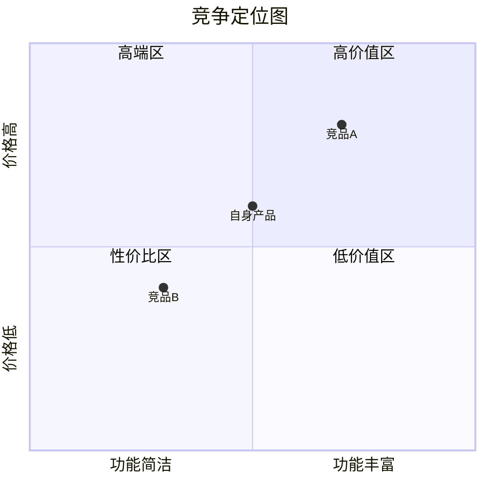

# 竞品分析报告自动生成

## 核心原则

1. **数据驱动结论先行**——每个结论必须有数据或证据支撑，禁止无依据推断
2. **结构化输出可交付**——报告是给决策者看的，不是给AI看的，可读性优先
3. **洞察重于数据堆砌**——数据是手段，洞察是目的，每份数据必须回答"所以呢"
4. **行动建议可执行**——策略建议必须具体到"做什么+为什么+预期效果"

## 交互模式

🤖→👤 AI建议人类审批

## 输入

| 输入项 | 类型 | 必填 | 来源 | 说明 |
|--------|------|------|------|------|
| 竞品情报数据 | JSON | ○ | output/pm-discovery/market-competitor-intel/competitor-intel.json | Feature Matrix、口碑、定价、战略信号 |
| 竞品四象限数据 | JSON | ○ | output/pm-discovery/market-competitor-quadrant/competitor-quadrant.json | 四象限分类与置信度 |
| 市场规模数据 | JSON | ○ | output/pm-discovery/market-tam-som/tam-som.json | TAM/SAM/SOM与增长率 |
| 宏观环境数据 | JSON | ○ | output/pm-discovery/market-pest/pest.json | PEST四维度趋势 |
| 品类关键词 | string | 是 | 用户提供 | 分析的品类范围，如"在线教育""SaaS CRM" |
| 自身产品信息 | string/markdown | ○ | 用户提供 | 自身产品定位、核心功能、目标用户、当前状态 |

## 执行步骤

### Step 1: 数据整合与竞品画像构建

整合上游数据，为每个核心竞品构建完整画像：

| 画像维度 | 数据来源 | 说明 |
|----------|---------|------|
| 产品定位 | intel / 用户提供 | 一句话定位、目标用户、核心价值主张 |
| 功能矩阵 | intel → feature_matrix | 功能覆盖度对比，标注差异化功能 |
| 用户口碑 | intel → reputation | 情感分布、Top痛点、用户迁移信号 |
| 定价策略 | intel → pricing | 价格区间、套餐结构、性价比评估 |
| 商业模式 | 用户提供 / AI推断 | 收入模式、获客方式、增长策略 |
| 团队与融资 | 用户提供 / AI推断 | 团队规模、融资轮次、资金储备 |
| 战略方向 | intel → strategic_signals | 推断的战略重心与置信度 |

**竞品筛选规则**：
- 深度画像数量：3-5个核心竞品（直接竞品优先）
- 超过5个时，按威胁程度排序取Top5
- 间接/替代竞品各取1-2个代表性案例

### Step 2: SWOT分析（逐竞品）

为每个核心竞品生成SWOT分析：

**Strengths（优势）**：
- 从feature_matrix中提取该竞品独有或领先的功能
- 从reputation中提取正面评价集中的维度
- 从pricing中提取定价优势

**Weaknesses（劣势）**：
- 从reputation.top_pain_points提取高频痛点
- 从feature_matrix中提取缺失功能
- 从pricing中提取性价比劣势

**Opportunities（机会）**：
- 竞品口碑中的共性痛点 → 自身的差异化机会
- 竞品战略方向的空白领域
- 市场增长中的未覆盖细分

**Threats（威胁）**：
- 竞品即将推出的功能（从strategic_signals推断）
- 竞品定价下调或免费化趋势
- 潜在竞品进入信号

**SWOT交叉策略矩阵**：

| 交叉 | 策略类型 | 说明 |
|------|---------|------|
| S+O | 增长策略 | 用优势抓住机会 |
| W+O | 改进策略 | 补短板以抓住机会 |
| S+T | 防御策略 | 用优势抵御威胁 |
| W+T | 危机预案 | 劣势遭遇威胁时的应对 |

### Step 3: 竞争定位图（Perceptual Map）

基于两个核心维度绘制竞争定位图：

**维度选择规则**：
- 优先选择用户决策时最关注的2个维度
- 常见维度组合：

| 品类特征 | 推荐维度X | 推荐维度Y |
|----------|----------|----------|
| 通用 | 功能丰富度 | 易用性 |
| 企业级 | 功能完整度 | 价格 |
| 消费级 | 用户体验 | 性价比 |
| 技术型 | 技术先进性 | 生态成熟度 |
| 垂直型 | 垂直深度 | 横向覆盖 |

**定位图输出**（Mermaid象限图）：


### Step 4: 竞争护城河评估

评估各竞品的护城河深度：

| 护城河类型 | 评估维度 | 评分标准 |
|-----------|---------|---------|
| 网络效应 | 用户增长是否增强产品价值 | 0-5分 |
| 转换成本 | 用户迁移到竞品的成本 | 0-5分 |
| 规模经济 | 规模是否带来成本优势 | 0-5分 |
| 品牌壁垒 | 品牌认知度和信任度 | 0-5分 |
| 技术壁垒 | 核心技术的不可复制性 | 0-5分 |
| 数据壁垒 | 数据积累的不可替代性 | 0-5分 |
| 生态壁垒 | 合作伙伴和集成生态 | 0-5分 |

**护城河深度评级**：
- 总分≥25：深护城河（难以撼动）
- 总分15-24：中等护城河（有突破空间）
- 总分<15：浅护城河（容易切入）

### Step 5: 市场份额估算

基于可用数据估算竞争格局：

| 估算方法 | 适用条件 | 数据来源 |
|----------|---------|---------|
| 自上而下 | 有TAM数据和公开市场份额 | 行业报告 + TAM数据 |
| 自下而上 | 有各竞品用户量/收入数据 | 竞品公开数据 |
| 相对份额 | 仅有定性对比 | AI基于多源信号推断 |

**市场集中度评估**：
- HHI指数计算（赫芬达尔-赫希曼指数）
- HHI<1500：分散竞争 / 1500-2500：适度集中 / >2500：高度集中

### Step 6: 差异化策略建议

基于前5步分析，生成差异化策略建议：

**策略推导逻辑**：

| 分析输入 | 策略方向 |
|----------|---------|
| 竞品共性痛点 | 痛点突破策略：解决竞品都未解决的核心问题 |
| 护城河浅的竞品 | 侧翼突破策略：从护城河最薄弱的竞品切入 |
| 定位图空白区域 | 定位空白策略：占据竞品未覆盖的定位空间 |
| SWOT交叉矩阵 | 杠杆策略：用自身优势抓住竞品劣势暴露的机会 |
| 市场分散格局 | 聚焦策略：在分散市场中聚焦一个细分做深 |

**每条策略包含**：
- 策略名称与一句话描述
- 策略依据（引用具体分析数据）
- 预期效果
- 风险与前提条件
- 优先级（P0/P1/P2）

### Step 7: 报告组装

将所有分析整合为完整的Markdown报告：

**报告结构**：

```
# {品类}竞品分析报告

## 执行摘要
- 一段话总结竞争格局
- 3条核心发现
- Top1策略建议

## 1. 市场概览
- 市场规模（TAM/SAM/SOM）
- 增长趋势与驱动力
- 宏观环境影响（PEST关键因素）

## 2. 竞争格局
- 四象限分类总览
- 市场份额估算
- 市场集中度评估

## 3. 竞品深度分析
### 3.1 {竞品A名称}
- 产品画像
- SWOT分析
- 护城河评估
### 3.2 {竞品B名称}
- ...

## 4. Feature Matrix功能对比
- 核心功能对比表
- 差异化功能标注
- 功能覆盖度评分

## 5. 用户口碑对比
- 情感分布对比
- Top痛点横向对比
- 差异化机会识别

## 6. 定价策略对比
- 价格区间对比
- 套餐结构对比
- 性价比评估

## 7. 竞争定位图
- Perceptual Map
- 定位空白区域分析

## 8. 差异化策略建议
- 策略1：{名称}
- 策略2：{名称}
- 策略3：{名称}

## 附录
- 数据来源清单
- 置信度标注
- 分析方法说明
```

## 输出

**存储路径**：`output/pm-discovery/market-competitor-report/`

**输出文件**：

| 文件 | 格式 | 说明 |
|------|------|------|
| competitor-report.md | Markdown | 完整竞品分析报告 |
| competitor-report.json | JSON | 结构化数据（供下游Skill引用） |

**competitor-report.json 结构**：

**输出Schema**：

```json
{
  "type": "object",
  "required": ["report_metadata", "executive_summary", "competitor_profiles", "differentiation_strategies"],
  "properties": {
    "report_metadata": {"type": "object", "description": "报告元数据，含品类、时间戳和置信度"},
    "executive_summary": {"type": "object", "description": "执行摘要，含竞争格局总结和核心发现"},
    "market_overview": {"type": "object", "description": "市场概览，含TAM/SAM/SOM和增长趋势"},
    "competitive_landscape": {"type": "object", "description": "竞争格局，含四象限摘要和市场份额估算"},
    "competitor_profiles": {"type": "array", "description": "竞品深度画像列表，含SWOT和护城河评估"},
    "feature_matrix_summary": {"type": "object", "description": "功能矩阵对比摘要"},
    "perceptual_map": {"type": "object", "description": "竞争定位图数据"},
    "differentiation_strategies": {"type": "array", "description": "差异化策略建议列表"}
  }
}
```

```json
{
  "report_metadata": {
    "category": "在线教育",
    "generated_at": "时间戳",
    "competitors_analyzed": 5,
    "data_sources": [],
    "overall_confidence": 0.0
  },
  "executive_summary": {
    "competition_landscape": "一段话总结",
    "key_findings": ["发现1", "发现2", "发现3"],
    "top_strategy": "Top1策略建议"
  },
  "market_overview": {
    "tam": 0,
    "sam": 0,
    "som": 0,
    "growth_rate": "0%",
    "key_drivers": [],
    "pest_highlights": []
  },
  "competitive_landscape": {
    "quadrant_summary": {},
    "market_share_estimate": [],
    "hhi_index": 0,
    "concentration_level": "分散/适度集中/高度集中"
  },
  "competitor_profiles": [
    {
      "name": "竞品名称",
      "positioning": "一句话定位",
      "swot": {
        "strengths": [],
        "weaknesses": [],
        "opportunities": [],
        "threats": []
      },
      "moat_score": {
        "network_effects": 0,
        "switching_cost": 0,
        "scale_economy": 0,
        "brand": 0,
        "technology": 0,
        "data": 0,
        "ecosystem": 0,
        "total": 0,
        "level": "深/中/浅"
      }
    }
  ],
  "feature_matrix_summary": {
    "total_features_compared": 0,
    "differentiation_features": [],
    "coverage_scores": {}
  },
  "perceptual_map": {
    "x_axis": "维度名称",
    "y_axis": "维度名称",
    "positions": [
      { "name": "竞品A", "x": 0.0, "y": 0.0 }
    ],
    "white_space": "空白区域描述"
  },
  "differentiation_strategies": [
    {
      "name": "策略名称",
      "description": "一句话描述",
      "evidence": "策略依据",
      "expected_impact": "预期效果",
      "risks": "风险与前提",
      "priority": "P0/P1/P2"
    }
  ]
}
```

## 决策规则

| 条件 | 决策 |
|------|------|
| 核心竞品数量<3 | 标注"竞品覆盖不足"，建议补充竞品后再生成报告 |
| 核心竞品数量>7 | 按威胁程度排序，取Top5深度分析，其余列入简表 |
| 护城河评估数据不足 | 标注各维度置信度，低置信度维度给出推断依据 |
| 市场份额无公开数据 | 使用相对份额估算，明确标注"估算值"和估算方法 |
| 自身产品信息缺失 | 差异化策略建议标注为"通用建议"，需结合自身情况调整 |
| PEST数据缺失 | 市场概览中跳过宏观环境章节，标注"缺乏PEST数据" |

## 质量检查

- [ ] 执行摘要包含3条核心发现+Top1策略
- [ ] 每个核心竞品有完整SWOT分析
- [ ] 竞争定位图已生成，含自身产品定位
- [ ] 护城河评估覆盖7个维度
- [ ] 差异化策略至少3条，每条有依据和优先级
- [ ] 所有推断标注了置信度
- [ ] 数据来源已列出
- [ ] Markdown报告格式完整，可直接交付

## 降级策略

| 缺失的上游输入 | 降级方案 | 输出影响 |
|---------------|---------|---------|
| 竞品情报数据缺失 | 基于品类关键词和用户提供信息推导竞品画像 | 功能矩阵和口碑数据可能不够精准 |
| 四象限数据缺失 | 基于品类关键词推导竞品分类 | 竞品分类可能不够全面 |
| TAM/SOM数据缺失 | 市场概览章节标注"缺乏市场规模数据" | 市场概览章节不完整 |
| PEST数据缺失 | 跳过宏观环境章节 | 市场概览缺少宏观视角 |
| 自身产品信息缺失 | 差异化策略标注为"通用建议" | 策略需结合自身情况调整 |
| 所有上游数据均缺失 | 基于品类关键词和AI知识库生成报告，整体置信度降低 | 报告深度有限，需人类大量补充验证 |
| 若用户未提供品类关键词 | 提示用户提供品类关键词，否则无法确定竞品分析范围 | - |

数据获取说明：
- 本Skill需要竞品情报和品类信息，请通过以下方式之一提供：
  1. 提供品类关键词和已知竞品名称（最低要求）
  2. 上传competitor-intel.json和competitor-quadrant.json文件
  3. 提供上游Skill输出文件路径
- AI不负责外部数据采集，仅负责分析和报告生成
